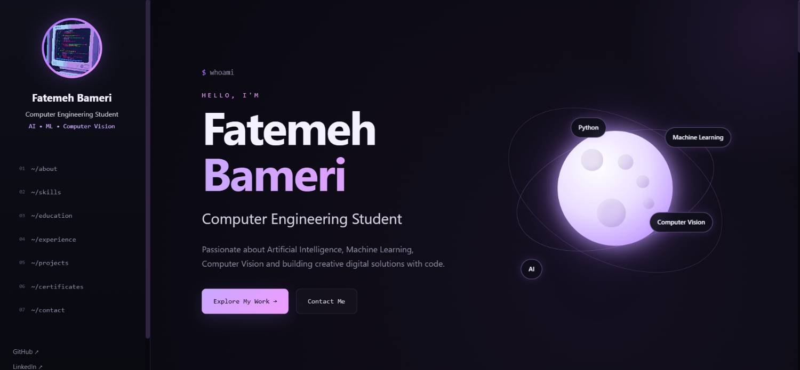

# 🌙 Fatemeh Bamerie — Online Portfolio

A modern, responsive online resume and portfolio for Fatemeh Bamerie, a Computer Engineering student interested in Artificial Intelligence, Machine Learning, Computer Vision, Python, and Web Development.

The portfolio combines a professional resume structure with a dark moon-inspired visual identity and a developer/terminal aesthetic.

## ✨ About The Project

This project was created as an online resume and personal portfolio.

The main goal was to present personal information, technical skills, education, experience, projects, certificates, and contact information in a modern and interactive way.

The visual concept of the website is based on "Code in the Moonlight", combining:

- Moon-inspired visual design
- Lavender and purple accents
- Pink highlights
- Developer and Terminal aesthetic
- Interactive skill orbit
- Smooth animations
- Responsive layout

## 🎯 Project Goals

The main goals of this project are:

- Creating a professional online resume
- Presenting technical skills and projects
- Practicing semantic HTML
- Practicing CSS Flexbox and Grid
- Creating a fully responsive layout
- Using JavaScript for interactive elements
- Building a visually memorable personal portfolio

## 🚀 Features

### 👩‍💻 Personal Profile

The sidebar contains:

- Profile image
- Name
- Academic title
- Areas of interest
- GitHub
- LinkedIn
- Email
- Navigation menu

### 🌙 Interactive Moon Skill Orbit

The hero section contains a moon-inspired interactive visual.

Several technical interests orbit around the moon:

- Python
- Machine Learning
- Computer Vision
- Artificial Intelligence

The skills are clickable and navigate to the Skills section.

### 🧠 Technical Skills

The portfolio presents technical skills and areas of interest including:

- Python
- OpenCV
- Computer Vision
- Machine Learning
- Artificial Intelligence
- HTML
- CSS
- C Programming

### 📚 Education

The Education section presents the academic background in a timeline-inspired layout.

B.Sc. in Computer Engineering

Refah University

### 💼 Work Experience

The Experience section presents relevant technical experience and practical work related to:

- Python
- OpenCV
- Image Processing
- Computer Vision

### 📁 Projects

Selected projects are presented in a developer-inspired project layout.

#### 01 — Bank Queue Simulation

A Python and Data Structures project based on queue simulation and priority-based customer management.

#### 02 — Image Processing Toolkit

A collection of practical image-processing and computer-vision implementations using Python and OpenCV.

#### 03 — AI Moon Landing Page

A responsive AI-themed landing page developed using HTML and CSS, using Flexbox, Grid, and responsive media queries.

### 📜 Certificates & Learning

A dedicated section for technical learning and continuous development in areas such as:

- Python
- Artificial Intelligence
- Machine Learning
- Computer Vision
- Web Development

### 📬 Contact

The Contact section provides an easy way to get in touch through email.

The portfolio also includes a contact form interface.

## 🛠️ Technologies Used

This project was created using:

- HTML5
- CSS3
- JavaScript

### HTML5

HTML is used to create the semantic structure of the portfolio, including:

- Header
- Navigation
- Main content
- Sections
- Articles
- Forms
- Footer

### CSS3

CSS is used for:

- Page layout
- Flexbox
- CSS Grid
- Responsive design
- Animations
- Transitions
- Hover effects
- Moon and orbit visual effects
- Dark theme and visual styling

### JavaScript

JavaScript is used for:

- Smooth navigation
- Active navigation states
- Intro interaction
- Typing effects
- Contact form interaction
- Dynamic footer year
- Interactive page elements

## 📱 Responsive Design

The portfolio is designed to work across different screen sizes:

- Mobile
- Tablet
- Desktop

The layout adapts to different screen widths using CSS media queries.

The sidebar, hero section, skills, projects, contact section, and other elements adjust their layout to maintain usability on smaller screens.

## 📂 Project Structure

    task2-2/
    ├── index.html
    ├── style.css
    ├── script.js
    ├── README.md
    └── images/
        ├── profile.jpg
        └── screenshot.png

## 🎨 Design Concept

The visual concept of this portfolio is:

"Code in the Moonlight"

The website uses a dark background combined with lavender, purple, and pink accents.

The moon represents creativity, exploration, and continuous learning.

The terminal-inspired elements create a connection with programming and software development.

Examples include:

    $ whoami
    ~/about
    ~/skills
    ~/education
    ~/experience
    ~/projects

These elements are used as part of the visual design to create a developer-oriented interface.

## 🪐 Interactive Visual Concept

One of the main visual elements of the website is the animated skill orbit.

The moon is placed at the center of the hero section while technical interests move around it.

The orbit includes:

- Python
- Machine Learning
- Computer Vision
- AI

Each skill can be selected to navigate to the Skills section.

## 📸 Screenshot

### Portfolio Preview

## 👩‍💻 Author

### Fatemeh Bamerie

Computer Engineering Student

Interested in:

- Artificial Intelligence
- Machine Learning
- Computer Vision
- Python
- Web Development

### Contact

Email: fatmhbamry039@gmail.com

GitHub: https://github.com/FatemehBamerie

## 🌱 Future Improvements

Possible future improvements include:

- Adding more real-world projects
- Adding live project demonstrations
- Connecting the contact form to a backend service
- Adding downloadable PDF resume
- Expanding the skills section
- Adding more interactive animations
- Adding detailed project pages
- Adding verified certificates

## 📌 Project Status

This portfolio is an ongoing personal project and may be updated as new skills, projects, and experiences are added.

## 📄 License

This project was created as a personal portfolio project.
